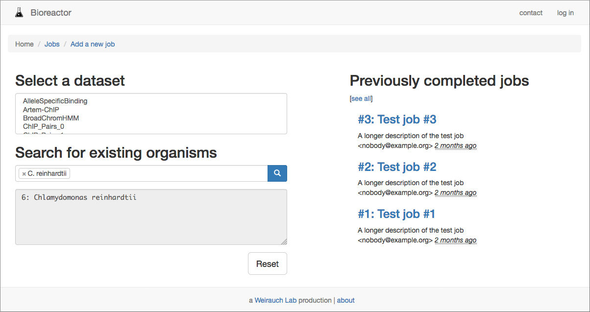

# Bioreactor User Manual
Flask+Python scaffolding for web-based bioinformatics analysis tools 

* **Project Home**:  <https://github.uc.edu/Bioreactor/bioreactor>
* **Documentation**: <https://github.uc.edu/Bioreactor/bioreactor/wiki>
* **Support**:       <https://github.uc.edu/Bioreactor/bioreactor/issues>

_If you are reading a printed or [PDF version](manual.pdf) of this
document, the current online version may be found at
https://github.uc.edu/pages/Bioreactor/bioreactor-docs (UC LDAP login may be
required)._

## Introduction

### Terminology
1. __JSON__: _JavaScript Object Notation_
2. __REST__: _Representational State Transfer_
3. __API__: _Application Programmer Interface_
4. __HPC (cluster)__: _High-Performance Computing_; a supercomputer
5. __microservice__: a collection of independent software systems, each
with limited scope, which communicate over a network, comprising all the
necessary functionality of a larger software application
6. __HTML__: _HyperText Markup Language_; code that represents the
presentation of web pages

[Bioreactor][] is a microservices-oriented web application, intended to be
used as "boilerplate" for generating a user-friendly front-end to
cluster-based bioinformatics analysis pipelines.

Bioreactor is built with the [Flask][] web application framework, and relies
on [SQLAlchemy][] for interfacing with a database. HTML templates comprising
the front-end user interface are written in the [Jinja2][] templating
language, and command-line management functionality relies on

The Bioreactor repository ships in a state which allows it to run simple
analyses on the same server hosting the web application, but requires some
local configuration by in order to do so. (See the
[**Customization**](#customization) section, below.)

More advanced customization, such as running analysis on an HPC cluster or
customizing the input forms requires a knowledge of HTML and Python web
development, both of which are beyond the scope of this document. Please refer
to the [project wiki][wiki] and the [**References**](#references) section,
below, for more information.

## Installation - your own server

These instructions assume that you have your own web server with
[Python 2.7.x][python], [pip][], and [virtualenv][] already installed. If you'd like
to experiment with the Bioreactor application (or contribute directly to the
core project), please refer to the [next section](#in-a-virtual-machine) for
guidance on setting up the development / testing virtual machine.

The first step in getting Bioreactor up-and-running is to clone (or download)
the repository to your local machine / server:

```bash
git clone https://github.uc.edu/Bioreactor/bioreactor.git
```

You can do local testing on any machine capable of running Python, but most of
the instructions below assume that you have cloned the repository into
a subdirectory of `/var/www` of a GNU/Linux system, such as CentOS, Debian, or
Ubuntu. This may be accomplished by:

```bash
# Become root on Debian / Ubuntu; try 'su - root' on others
sudo -s

# create a web application directory and set default permissions
cd /var/www
mkdir bioreactor

# give your developer user group permissions to this directory
# example for a group called 'devel'; will be different at your site
setfacl -m -d g:devel:rwx bioreactor
setfacl -m g:devel:rwx bioreactor

# clone into this directory
git clone https://github.uc.edu/Bioreactor/bioreactor.git bioreactor
```

Now, proceed to the next section to create a Python "virtual environment"
("virtualenv") into which you'll install the necessary dependencies for the
Bioreactor web application.

### Establishing a Python virtualenv

It's recommended to create a "virtual environment" to manage the
runtime dependencies for Bioreactor. Basically, `virtualenv` puts a copy of
the Python interpreter and any libraries installed (_e.g._, with `pip`) within
a subdirectory of the project. This is to reduce the reliance on system
packages, and prevent updates at the OS level from breaking the application.

This directory, conventionally `venv` or `env`, is purposely excluded from
version control in the `.gitignore` for the repository. You should not make
local code changes within this directory.

In order to set up the virtual environment after having downloaded or `git
clone`d Bioreactor from GitHub, do this (here we are assuming that the repo
was cloned to `/var/www/bioreactor`):

    # 'cd' to wherever the Bioreactor repository was originally cloned
    cd /var/www/bioreactor

    # 'venv' is conventional; other scripts (mentioned below) rely on it
    virtualenv venv

    # ...actually enter the virtual environment 
    source venv/bin/activate

    # and install necessary packages using 'pip' and the 'requirements.txt' file
    pip install -r requirements.txt

Your shell prompt will change to reflect whether or not you're inside
a virtual environment (see the screenshot in the next section). If you wish to
exit the environment `deactivate` is the command to do that. You will still
remain logged in, but packages installed within `venv` won't be available.

### Starting the Bioreactor server

There are an exasperating number of different methods for launching a Flask
application, but any of the following should currently work (subject to
change):

```bash
cd /to/where/you/cloned/bioreactor
export FLASK_APP=bioreactor/bioreactor.py
flask run --host=0.0.0.0 --port=5000
# or
python bioreactor/bioreactor.py
# or
supervisord && supervisorctl status bioreactor
```

You can then point your browser at <http://localhost:5000> and you should see
a screen like this:



This represents just a basic framework for a web application which you would
then customize (see [**Customization**](#customization), below) to your needs.

### Enabling web-based database management

You can use the provided copy of [Adminer][] to manage the database tables for
the Bioreactor application using a simple web interface. On Debian / Ubunutu,
this will require the `php5` and `php5-sqlite` packages be installed (possibly
called, simply `php` and `php-sqlite` in later releases).

You can make the `db` directory web-accessible with an Apache config similar
to what's shown below.  On a "production" system, you also should (at
a minimum) enable HTTP authentication on the `db` subdirectory, because at the
present time Adminer has been modified to load the SQLite database directly
from the disk without prompting for a username or password.

```apache
<Directory /var/www/bioreactor/db>
    AllowOverride all
    Options -Indexes

    # Ref: https://httpd.apache.org/docs/2.4/howto/auth.html
    AuthName "Bioreactor database admin"
    # Create a username/password pair with 'htpasswd -c <dbname> <user>'
    AuthUserFile "/var/www/bioreactor/htpasswd"
    AuthType Basic

    Order deny,allow
    Allow from all
    Require valid-user
</Directory>
Alias "/dbadmin" "/var/www/bioreactor/db"
```

On the development VM (see the next section), this section is already present
in `/etc/apache2/sites-available/990-bioreactor.conf`, but commented out by
default.

**WARNING**: To facilitate development, Adminer has been hard-coded to open
`db/bioreactor.db` directly off the filesystem, without asking for a username
or password.  Support for other database systems may be re-enabled by:

1. having a look at [`db/index.php`](db/index.php) and the
   [Adminer API documentation][adminerapi] and modifying the `login()` method,
   or
2. possibly commenting out the `<FilesMatch>` directive in
   [`db/.htaccess`](db/.htaccess) and loading the `adminer-x.y.z.php` script
   directly in the browser (which is otherwise denied by the `.htaccess`)


## Installation - in a VM

The [bioreactor-vm][vmrepo] repository contains configuration files which may
be used to build a development / test server environment for the
[Bioreactor][] analysis application within a [VirtualBox][] virtual machine.

The Bioreactor VM image is based on Debian 8.5.0 (codename "jessie"), using
the "netinst" ISO found here:

    http://cdimage.debian.org/debian-cd/8.5.0/arm64/iso-cd/

### Requirements

0. [VirtualBox][] - the virtual machine environment
1. [Vagrant][] - to automatically configure and provision the VM
2. [PuTTY][] - on Windows, to connect to the VM over Secure Shell
3. [veewee][] - if and _only_ if you want to re-build the base box from scratch


### Linux / Mac OS X quick start

In a terminal (`/Applications/Utilities/Terminal.app` on a Mac), `cd` to the
directory where you cloned this repository, then run [`./setup.sh`][setupsh].

### Windows quick start

Open the "Command Prompt" application with the current working directory set
the top level of the cloned repository by [right-clicking on the
directory][wincmd] in Explorer, then choosing "Open command window here".

At the prompt, type `setup.cmd` and press ENTER.

### Details

The `setup.sh` script (or `setup.cmd` on Windows) basically just performs these
two steps for you:

```bash
BASEBOX=https://tf.cchmc.org/external/ern6xv/bioreactor-jessie.box
vagrant box add bioreactor $BASEBOX
vagrant up
```

Failing that, you can see the
"[Re-building the base box](#re-building-the-base-box)" section below for
guidance on how to create the base VM image from the original Debian ISO.

#### Logging in to the VM

In order to connect with the VM over SSH, normally you would just type
`vagrant ssh` inside the directory where you originally cloned this
repository. However, you _can_ add an entry to your `~/.ssh/config`, allowing
you to also type `ssh vagrant` (or something even shorter) basically anywhere
in your path:

    # The 'Host' line in the ssh config can list multiple "aliases" for the same host
    Host vagrant vm v
        Host localhost
        Port 9922
        IdentityFile "/path/to/this/repo/.vagrant/machines/debian_jessie/virtualbox/private_key"

You can also use Vagrant's built in `vagrant ssh-config` as a (considerably
more complex) template for creating these SSH `config` entries for other
boxes, too.

```bash
cd /path/to/this/repo
vagrant ssh-config >> ~/.ssh/config
# ...then modify it to your liking
vim -c% ~/.ssh/config
```

The advantage of allowing `vagrant ssh` to handle the SSH connection is just
so: it will automatically know where to find the right public / private
keypair for passwordless authentication.

#### Authentication

The `vagrant` user on the VM is in the `sudoers` file (by way of being a
member of the group `sudo`), with no password.

Its default password is `vagrant` if you are prompted for authentication by
any programs on the VM that don't understand `sudoers`, or if you haven't set
up your [`~/.ssh/config`][mansshcfg] as described below, and you want to SSH or
SFTP into the VM using a different program (say, perhaps, [Cyberduck][]).

#### Forwarded ports

The `Vagrantfile` will automatically create the following forwarded ports for
you. 

| Guest (VM) port forwards to...  | Host port #      | Notes                    |
| ------------------------------- | ---------------- | ------------------------ |
| 22                              | 9922             | Secure Shell (see below) |
| 80                              | [9980][lh9980]   | Apache HTTP server       |
| 5000                            | [55000][lh55000] | Python / Flask app       |

It was after some deliberation that I decided to stick with 55000 for the
Flask server, so that it wouldn't interfere with the default configuration of
a local Flask server you might be experimenting with. Just make a bookmark to
<http://localhost:55000> and remember that it goes with the Flask app running
on the VM.

### Re-synchronizing with upstream

The `vagrant up` step above will run a Vagrant "shell provisioner" (basically
an inline shell script within the `Vagrantfile`) that will invoke
`bin/self-provision.sh` on the VM, from the default `/vagrant` shared folder
(which is, mind-bendingly, mapped to the directory whoere you originally cloned
this repository on the _host_).

The `self-provision.sh` script will, in turn, run a series of Ansible
"playbooks": a sequence of tasks to automate sysadmin tasks such as installing
packages and properly configuring the Apache server. The Ansible provisioning
process is [idempotent][], which means that you can re-run the playbooks over
and over and they shouldn't affect the state of the VM if the required tasks
have already been performed—only required steps that weren't (successfully)
completed before will be executed.

In order to pick up any upstream changes in these "playbooks" you can just run
`git pull` followed by `vagrant provision` in the directory on your _host OS_
where you originally cloned the `bioreactor-vm` repository. (Alternatively, you
can run `/vagrant/bin/self-provision.sh` _on the VM_, which accomplishes the
same thing.)

That being said, it wouldn't hurt to make sure that any uncommited changes to
the Bioreactor codebase have been committed and pushed (perhaps to a `dev` tree
in a private fork), just in case.

### Implementation details

#### Where does the Vagrant "base box" comes from, anyhow?
The `bioreactor-jessie.box` file currently used by the setup script is stored
on `tf.cchmc.org` at this location:

    https://tf.cchmc.org/external/ern6xv/bioreactor-jessie.box

If for some odd reason, you have already downloaded the base box you can
point the script at the existing `.box` file like so:

```bash
VAGRANT_BOX=~/Downloads/bioreactor-jessie.box ./setup.sh
```

or by altering the value of `VAGRANT_BOX` at the top of the script.

There's almost no reason why you would need to do this unless the production
Weirauch Lab server goes belly-up.

#### Re-building the base box

On Mac OS X, you'll probably want to use [`rbenv`][rbenv] to download and
install a "modern" (_e.g._, 2.3.x) release of Ruby, because you're destined to
have problems with the OS version of Ruby (2.0.something) otherwise.

```bash
# MacPorts
sudo port install rbenv ruby-build
# Homebrew (not sure whether 'ruby-build' will come with)
brew install rbenv

# Initialize rbenv (follow the directions given to modify ~/.bash_profile)
rbenv init

# Get a (newer) Ruby interpreter; 'ruby-build' is required for this to work
rbenv install --list  # 2.3.0 is latest available 2.3.x as of this writing
rbenv install 2.3.0

# Switch into the repo base dir and tell 'rbenv' to use this Ruby version
cd ~/path/to/this/repo
rbenv local 2.3.0

# To work around a problem with libxml2 2.9.4, I think; refer to
# https://github.com/sparklemotion/nokogiri/issues/1119#issuecomment-68428866
gem install nokogiri -- --use-system-libraries
# Not properly downloaded as a dependency of 'veewee' for some reason
gem install net-scp
gem install veewee
```

## Customization

_NOTE: This section of the user manual is momentarily under development._

The front end UI of the Bioreactor "boilerplate" application is intended to be
heavily customized to suit your purposes. The HTML templates (in [Jinja2][]
format) are stored within the `bioreactor/static` and
`bioreactor/static/partials` of the base directory of the repository.

Back-end analysis scripts should be stored in the `scripts` directory, and are
expected to accept input arguments as positional parameters (_e.g._, `$1`,
`$2`, `$3`) when excuted in a subshell by the server process, or when
submitted to an HPC cluster for batch processing.

Please see `bioreactor/config.py` for a list of configurable parameters,
including supported database and batch scheduling systems. The config file is
well-commented.

## Advanced Deployment

The default method for running the Bioreactor Flask web application (as
outline above) is suitable for testing, development, and small workgroups.

If you are deploying your Bioreactor application in a production environment
you have several options for running a "standalone" version of the Flask web
application, which are discussed in detail in the
[Flask documentation][flask-wsgi].

If you wish to run your Flask application on the standard HTTP port 80, you
can either pass `--port=80` to `flask run` or transparently proxy the default
Flask port (5000) through port 80 using a web server like Apache. Here's
a sample configuration to accomplish that with Apache 2.x:

```apache
# Source: http://stackoverflow.com/a/13089668
ProxyPreserveHost On
ProxyRequests Off
ServerName bioreactor.yourdomain.org
ProxyPass / http://localhost:5000/
ProxyPassReverse / http://localhost:5000/

# Optionally, require a password for the Bioreactor application on port 80
<Location />
    AuthType Basic
    AuthName "Bioreactor Test Server"
    AuthUserFile /etc/apache2/passwd/phyloweb
    Require valid-user
    Order deny,allow
    Allow from none
    Satisfy all
</Location>

# Don't proxy this directory (example)
<Location /icons>
    ProxyPass "!"
</Location>
```

## Giving feedback

Something unclear in the documentation? Found a bug in the Bioreactor server
application? Please file an issue on the
[project's GitHub issue tracker][issues].

## References

* [Flask Quickstart][flask-qs]
* [Python Web Applications With Flask][rp-flask]

## Credits
The HTML version of this document makes use of Junil Um's
[markdown-toc](https://github.com/powerumc/markdown-toc), which in turn makes
use of the [Tocify](http://gregfranko.com/jquery.tocify.js/) jQuery plugin by
Greg Franko, 

The PDF version of this document was created with John MacFarlane's
[Pandoc](http://johnmacfarlane.net/pandoc/index.html) document processing
system.

[adminer]: https://www.adminer.org/
[adminerapi]: https://www.adminer.org/en/extension/
[ansible]: https://docs.ansible.com/
[autoenv]: https://github.com/kennethreitz/autoenv 
[bashcomp]: https://www.gnu.org/software/bash/manual/html_node/Programmable-Completion-Builtins.html
[bioreactor]: https://github.uc.edu/Bioreactor/bioreactor
[cyberduck]: https://cyberduck.io/
[flask-wsgi]: http://flask.pocoo.org/docs/0.11/deploying/wsgi-standalone/
[flask]: http://flask.pocoo.org/
[flaskconfig]: http://flask.pocoo.org/docs/0.11/config/#builtin-configuration-values
[flask-qs]: http://flask.pocoo.org/docs/0.11/quickstart/
[ghdeploykeys]: https://developer.github.com/guides/managing-deploy-keys/#deploy-keys
[gunicorn]: http://docs.gunicorn.org/en/latest/run.html
[idempotent]: https://en.wikipedia.org/wiki/Idempotence 
[issues]: https://github.uc.edu/Bioreactor/bioreactor/issues
[jinja2]: http://jinja.pocoo.org/
[lh55000]: http://localhost:55000
[lh9980]: http://localhost:9980
[mansshcfg]: http://man.cx/ssh_config(4)
[mod_wsgi]: http://flask.pocoo.org/docs/0.11/deploying/mod_wsgi/#configuring-apache
[pip]: https://pip.pypa.io/en/stable/
[putty]: http://www.chiark.greenend.org.uk/~sgtatham/putty/download.html
[python]: https://www.python.org/downloads/
[rbenv]: https://github.com/rbenv/rbenv
[rp-flask]: https://realpython.com/blog/python/python-web-applications-with-flask-part-i/
[setupsh]: setup.sh 
[setupshline8]: setup.sh#L8
[sqlalchemy]: http://www.sqlalchemy.org/
[supervisor]: http://supervisord.org/running.html
[vagrant]:  https://vagrantup.com
[vagrant]: https://www.vagrantup.com/
[veewee]: https://github.com/jedi4ever/veewee
[veeweeisorb]: https://github.com/jedi4ever/veewee/blob/master/lib/veewee/provider/core/helper/iso.rb#L158
[virtualbox]: https://virtualbox.org
[virtualenv]: http://docs.python-guide.org/en/latest/dev/virtualenvs/
[vmrepo]: https://github.uc.edu/Bioreactor/bioreactor-vm
[wiki]: https://github.uc.edu/Bioreactor/bioreactor/wiki
[wincmd]: http://mingersoft.com/blog/2011/02/open-a-command-prompt-quickly-in-windows-7/

<!-- Vim modeline; please don't remove
 vim: tw=78 sw=4 ts=4 expandtab filetype=markdown
-->
